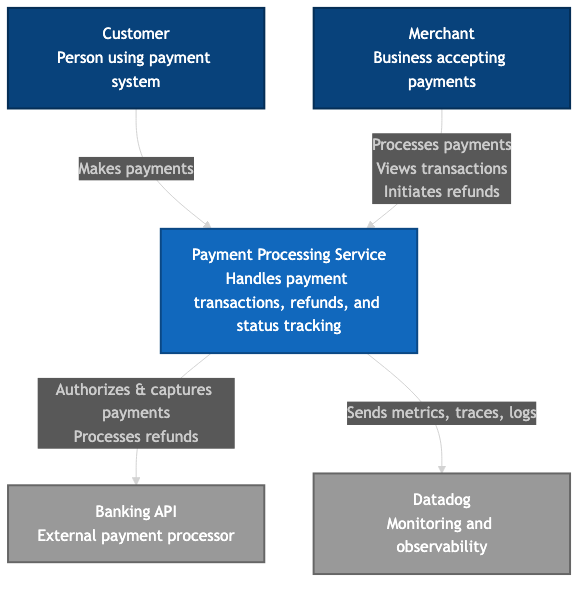
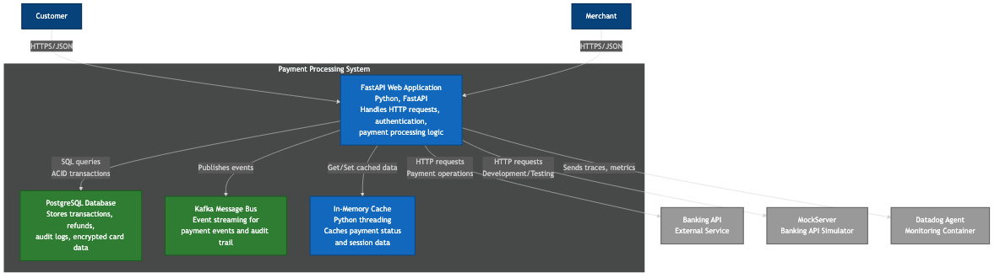
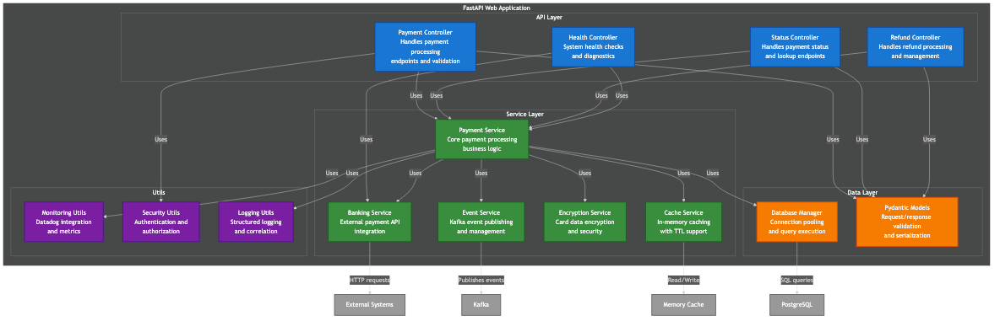
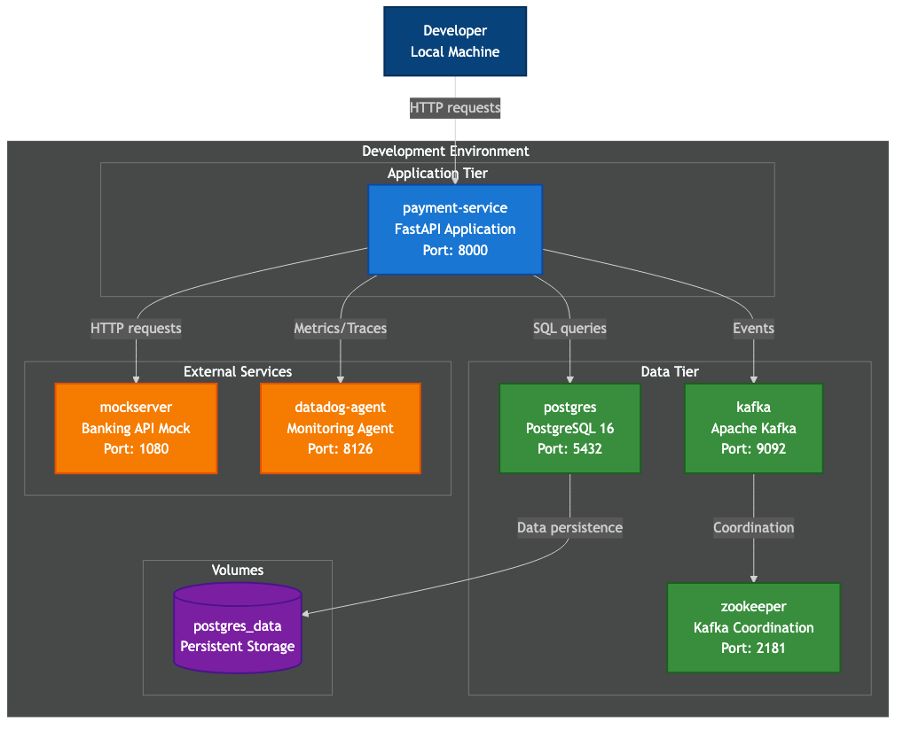
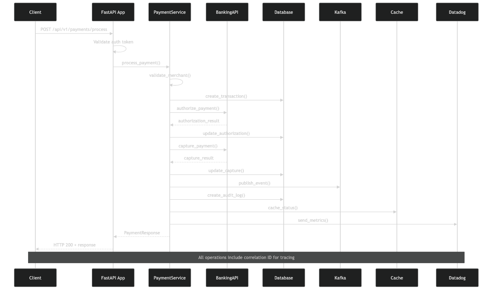
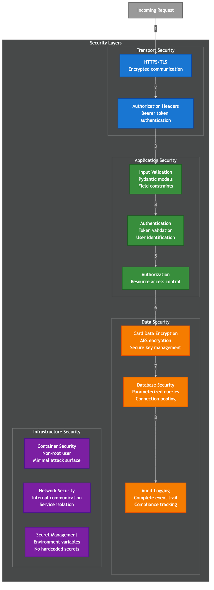

# Payment Service Documentation

This directory contains comprehensive documentation for the Payment Processing Service.

## 📊 Architecture Diagrams

The C4 model diagrams provide different levels of architectural detail:

### System Level Diagrams

**C1 - System Context**

*Shows how the payment service fits within the broader system landscape*

**C2 - Container Diagram**

*Details the high-level technology choices and how containers communicate*

**C3 - Component Diagram**

*Breaks down the FastAPI application into its key components*

### Specialized Views

**Deployment Architecture**

*Shows the Docker Compose development environment setup*

**Data Flow**

*Illustrates the complete payment processing workflow*

**Security Architecture**

*Details the multi-layered security approach*

## 🔄 Generating Diagrams

To regenerate the PNG diagrams from source:

```bash
# Generate all diagrams
make diagrams

# Clean and regenerate all diagrams
make diagrams-clean

# Or use the script directly
./scripts/generate_diagrams.sh
```

### Requirements for Diagram Generation

- Node.js and npx
- Mermaid CLI (installed automatically)

The diagrams are generated from Mermaid source files (`.mmd`) located in the `diagrams/` directory.

## 📁 File Structure

```
docs/
├── README.md                    # This file
├── c4-diagrams.md              # Complete C4 diagrams with Mermaid source
└── diagrams/
    ├── c1-system-context.mmd   # System context source
    ├── c1-system-context.png   # System context image
    ├── c2-container.mmd        # Container diagram source
    ├── c2-container.png        # Container diagram image
    ├── c3-component.mmd        # Component diagram source
    ├── c3-component.png        # Component diagram image
    ├── deployment.mmd          # Deployment diagram source
    ├── deployment.png          # Deployment diagram image
    ├── data-flow.mmd           # Data flow source
    ├── data-flow.png           # Data flow image
    ├── security-architecture.mmd # Security diagram source
    └── security-architecture.png # Security diagram image
```

## 🎯 Diagram Usage

### For Presentations
- Use PNG files for presentations and documentation
- High resolution (1200x800) suitable for projection
- Dark theme with transparent background

### For Development
- Refer to Mermaid source files for editing
- Version control friendly text format
- Easy to modify and maintain

### For Documentation
- Include PNG images in markdown files
- Reference specific diagrams for different audiences:
  - **C1**: Business stakeholders, project managers
  - **C2**: Solution architects, DevOps teams  
  - **C3**: Software architects, senior developers
  - **Deployment**: Operations teams
  - **Data Flow**: Integration teams
  - **Security**: Security teams, compliance

## 🛠️ Updating Diagrams

1. Edit the `.mmd` source files in the `diagrams/` directory
2. Run `make diagrams` to regenerate PNG files
3. Commit both source and generated files to version control

## 📖 Additional Documentation

- **API Documentation**: Available at `/docs` when service is running
- **README**: Project overview and quick start guide  
- **Code Documentation**: Inline docstrings and type hints throughout the codebase