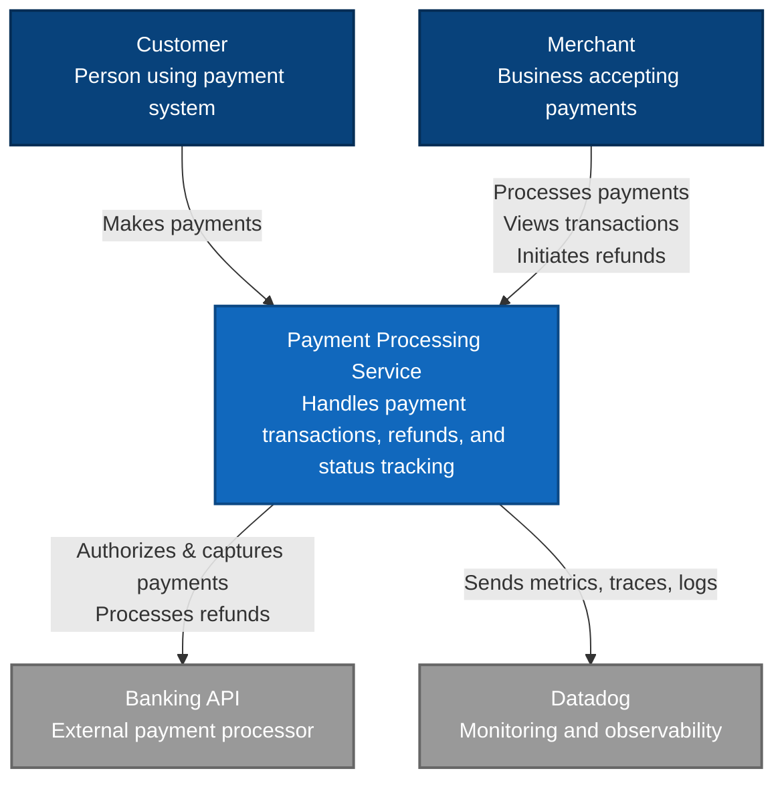
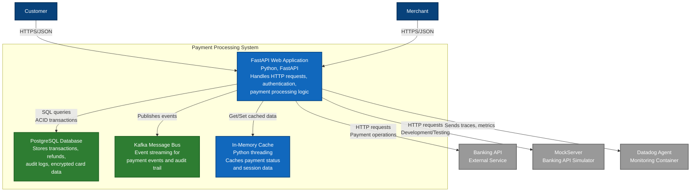
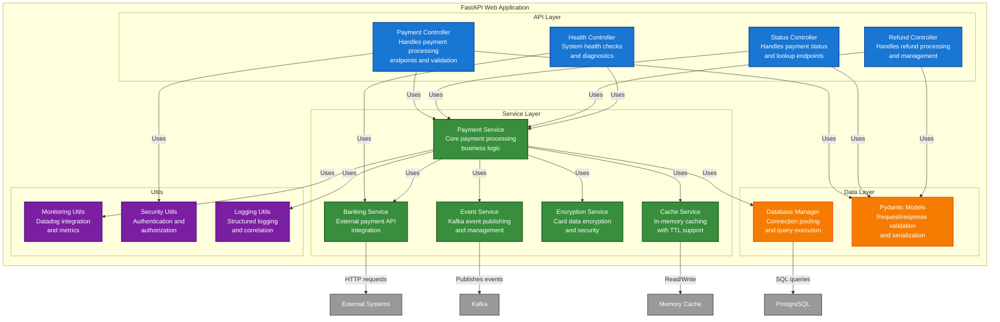
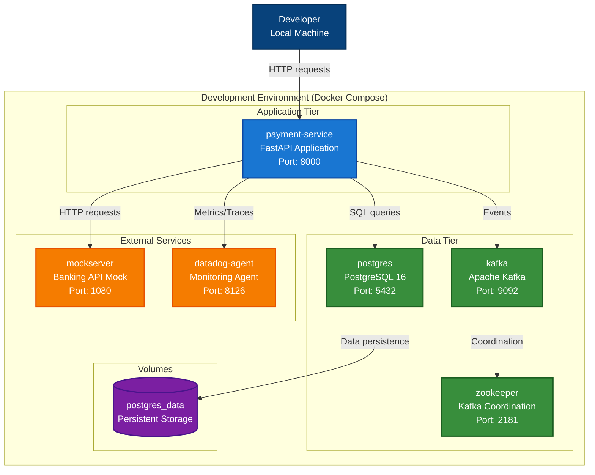
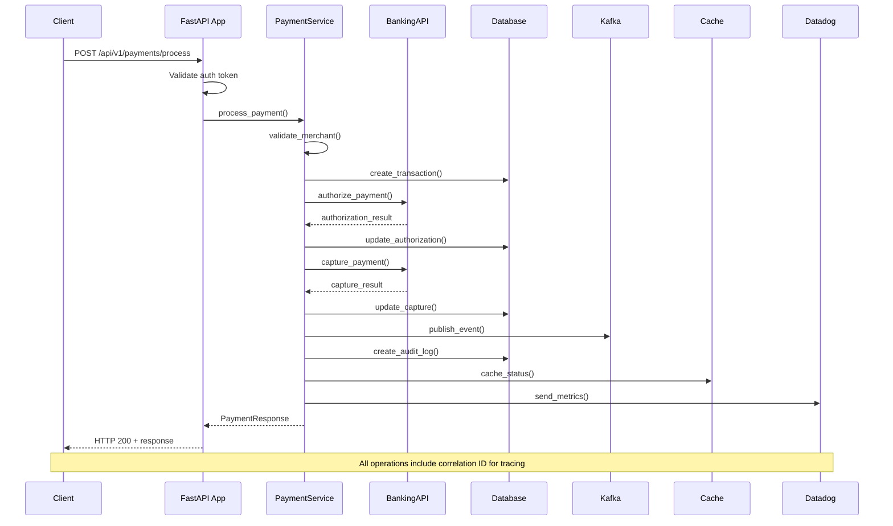
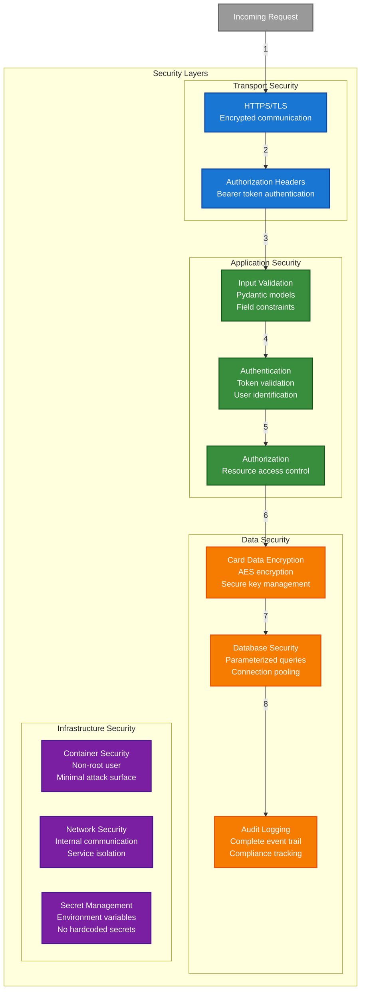
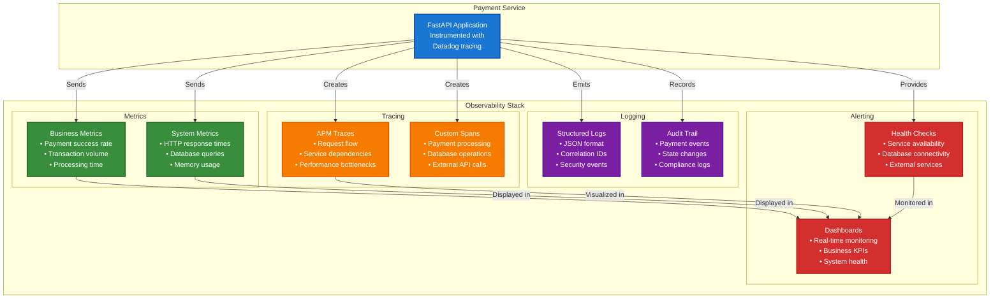

# C4 Architecture Diagrams

This document contains C4 model diagrams for the Payment Processing Service, providing different levels of architectural detail.

## C1 - System Context Diagram



## C2 - Container Diagram



## C3 - Component Diagram (Web Application)



## C4 - Code Diagram (Payment Service)

```mermaid
graph TB
    subgraph "Payment Service Component"
        subgraph "Public Interface"
            ProcessPayment[process_payment()<br/>async def]
            GetStatus[get_payment_status()<br/>async def]
            ProcessRefund[process_refund()<br/>async def]
        end
        
        subgraph "Private Methods"
            ValidateMerchant[_validate_merchant()<br/>async def]
            CreateTransaction[_create_transaction()<br/>async def]
            AuthorizePayment[_authorize_payment()<br/>async def]
            CapturePayment[_capture_payment()<br/>async def]
            UpdateStatus[_update_transaction_status()<br/>async def]
            PublishEvent[_publish_payment_event()<br/>async def]
            CreateAuditLog[_create_audit_log()<br/>async def]
        end
        
        subgraph "Dependencies"
            BankingServiceDep[banking_service<br/>BankingService]
            EventServiceDep[event_service<br/>EventService]
            EncryptionServiceDep[encryption_service<br/>EncryptionService]
            CacheServiceDep[cache_service<br/>CacheService]
        end
        
        subgraph "Models"
            PaymentRequest[PaymentRequest<br/>Pydantic Model]
            PaymentResponse[PaymentResponse<br/>Pydantic Model]
            RefundRequest[RefundRequest<br/>Pydantic Model]
            RefundResponse[RefundResponse<br/>Pydantic Model]
        end
    end
    
    subgraph "External Dependencies"
        DatabaseManager[database_manager<br/>Global instance]
        MonitoringUtils[monitoring utils<br/>create_span, increment_counter]
        Logger[structlog logger<br/>Structured logging]
    end
    
    ProcessPayment -->|calls| ValidateMerchant
    ProcessPayment -->|calls| CreateTransaction
    ProcessPayment -->|calls| AuthorizePayment
    ProcessPayment -->|calls| CapturePayment
    ProcessPayment -->|calls| UpdateStatus
    ProcessPayment -->|calls| PublishEvent
    ProcessPayment -->|calls| CreateAuditLog
    
    ProcessPayment -->|uses| BankingServiceDep
    ProcessPayment -->|uses| EncryptionServiceDep
    ProcessPayment -->|uses| EventServiceDep
    ProcessPayment -->|uses| CacheServiceDep
    
    GetStatus -->|uses| CacheServiceDep
    GetStatus -->|uses| DatabaseManager
    
    ProcessRefund -->|calls| AuthorizePayment
    ProcessRefund -->|calls| PublishEvent
    ProcessRefund -->|calls| CreateAuditLog
    
    ProcessPayment -->|accepts| PaymentRequest
    ProcessPayment -->|returns| PaymentResponse
    ProcessRefund -->|accepts| RefundRequest
    ProcessRefund -->|returns| RefundResponse
    
    ProcessPayment -->|uses| MonitoringUtils
    ProcessPayment -->|uses| Logger
    
    classDef public fill:#1976d2,stroke:#0d47a1,stroke-width:2px,color:#fff
    classDef private fill:#388e3c,stroke:#1b5e20,stroke-width:2px,color:#fff
    classDef dependency fill:#f57c00,stroke:#e65100,stroke-width:2px,color:#fff
    classDef model fill:#7b1fa2,stroke:#4a148c,stroke-width:2px,color:#fff
    classDef external fill:#999999,stroke:#666666,stroke-width:2px,color:#fff
    
    class ProcessPayment,GetStatus,ProcessRefund public
    class ValidateMerchant,CreateTransaction,AuthorizePayment,CapturePayment,UpdateStatus,PublishEvent,CreateAuditLog private
    class BankingServiceDep,EventServiceDep,EncryptionServiceDep,CacheServiceDep dependency
    class PaymentRequest,PaymentResponse,RefundRequest,RefundResponse model
    class DatabaseManager,MonitoringUtils,Logger external
```

## Deployment Diagram



## Data Flow Diagram



## Security Architecture



## Monitoring and Observability



---

These C4 diagrams provide a comprehensive view of the Payment Processing Service architecture at different levels of detail, from the high-level system context down to specific component implementations. Each diagram serves a different audience and purpose:

- **C1 (Context)**: For business stakeholders and project managers
- **C2 (Containers)**: For solution architects and DevOps teams
- **C3 (Components)**: For software architects and senior developers
- **C4 (Code)**: For developers working on specific components

The additional diagrams (Deployment, Data Flow, Security, Monitoring) provide specialized views for operations, security, and observability concerns.